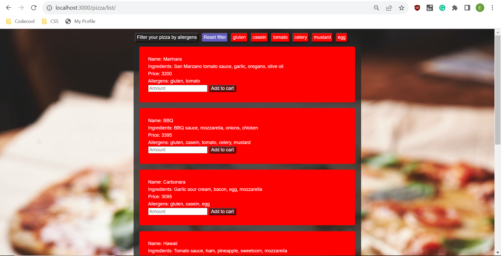
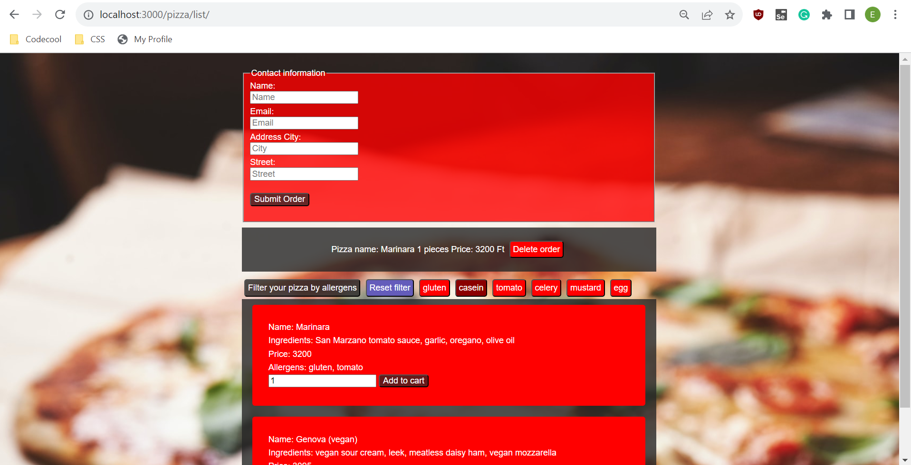

## **:point_right: In this teamwork project using JS, HTML, and CSS, we had to create a simple pizza order website where our pizza list is filterable by allergens.** :point_left: ##

## Project Setup Instructions

### Clone Repository:
Clone this repository to your local machine.

### Navigate to Project Folder:
Open the project folder in your preferred Integrated Development Environment (IDE).

### Install Dependencies:
In the terminal, run the following command to install project dependencies:

``` npm install ```

This command installs the necessary modules and their dependencies specified in the package.json file.


### Start the Application:
Once the installation is complete, start the application by running the following command:

``` npm start ```

This command initiates the server and makes the application accessible.

### Access the Pizza List:
Open your preferred web browser and go to:

``` localhost:3000/pizza/list ```

This will display the pizza list in the browser.

### View Orders (Optional):
If you want to view the existing orders, enter the following URL in your browser:

``` localhost:3000/api/order ```

This will show a list of orders via the API endpoint.

**Now you're all set! Explore the pizza list and, if needed, check the existing orders through the provided API endpoint.**


## Pictures of the website ##




